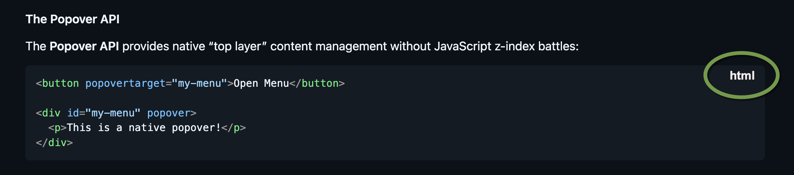

# Code and Markdown Highlighting

ultrathink and create a detailed multi-step plan for the following feature/task:

**IMPORTANT: the `rust-code-highlighting`, `escape-codes`, and `cmark_pulldown` skills to help you design and execute!**

**IMPORTANT: any markdown parsing should use the `cmark-pulldown` library unless there is a really good reason not to**
**IMPORTANT: if for some reason **cmark-pulldown** isn't a good fit then you can consider `markdown-rs` which takes a more AST based approach but isn't as fast. If this is done then you should use the `markdown-rs` skill**

**NOTE:** Textmate grammars are preferred over other options for code theming
**IMPORTANT: use the `syntect` crate for highlighting unless there are good reasons not to**


1. Determine the best code-highlighting and parsing approach/library for this library which can achieve the following requirements:

    - there will be two exposed utility functions:
        - `highlight_code(code_text, options)`, and
        - `format_markdown(text, options)`
            - `format_markdown(...)` will be responsible for formatting the markdown text _as well as_ parsing any code blocks found in the markdown
            - will need to have clear visual separation between the prose and the code block
                - the top line of the code block should indicate the language that the code block is

                    

                - if the code block has text after the language has been specified then this should be treated as a TITLE for the code block and added to the top line which includes the language specifier:

                    ~~~md
                    here is some prose before the code block.

                    ```ts My Typescript Function
                    function MyFunction() {
                        console.log("hi")
                    }
                    ```
                    ~~~

                  In this example the first line will have `My Typescript Function` on the left and `ts` on the right

            - if the output format is HTML, then:
              - hovering over the language should animate a variant which indicates action can be taken
              - clicking on the language specifier should provide an animated response as the code is copied to the clipboard.


    - the **options** will include the ability to:
        - specify a light and dark theme for code
        - specify a light and dark theme for text (only available on `format_markdown`)
        - there will be _defaults_ theme choices for light and dark text as well as code
        - there will be an option to include line numbers which will add line numbers to the left of every line in the code (no effect for markdown content NOT in a code block)
        - there will be an option to highlight one or more sections of the code with "red squigglies" or some other noticeable ornamentation to highlight where errors have occurred.
            - When the output format is HTML we should not only show the "red squigglies" under the error but also use the HTML's new "popover" syntax to add a popover with a description of the error. 
            - When the output format is the console the popover is not necessary (or possible)
        - when parsing through markdown, the code blocks should not only highlight the code but provide some visible indication that we're "now in a code block" 

    - We will need to be able to highlight Typescript code both for HTML output and console output:
        - HTML: 
            - the parsed output will have some combination of div/span tags with classes references that apply the styling
            - the CSS which actually provides the styling information should be standards based so that we can use well known code highlighting themes to provide the styling
        - Console:
            - We should assume that the console the caller is using can support true-colors
            - We should use ANSI 24-bit color escape codes for color and ANSI SGR for italics, underlining, bold, dim, etc.
            - the console colors should follow the same color conventions and themes as the HTML output
        - The implementation should try to abstract any utilities that can be shared across the HTML and Console outputs as possible
        - 

2. Design a utility function called `highlight_code(code_text, light_theme?, dark_theme?)` which 
3. Initial use of the **highlight_code** function:

    - so that we can see the utility function in action we'll first start using it with the **source** command.
    - here you'll find a before and after example output from running `ta source -d cli/tests/fixtures`:

        **Current Console Output:**

        ```txt
        [error] in processUser
         at ./src/errors.ts:6:8
         Identifier `userId` has already been declared
         userId

        // ...
        ```

        **Console Output With highlight_code():**
        > Note: obviously we can't demonstrate the precise colors and styling here
        > instead we're just trying to show how the "identifier" in the BEFORE example is
        > replaced with a code block

        ```txt
        ERROR in processUser() at ./src/errors.ts:6:8
        
          export function processUser() {
              // Redeclaration error - OXC detects this
              let userId = 1;
              let userId = 2;  // Error: Identifier 'userId' has already been declared

              return userId;
          }

        // ...
        ```


    - the amount of code to show when an error is encountered follows this business logic:
       - if in **function** or **class method**:
           - if function/method is less than 15 lines of code:
               - show full function/method definition
           - if not:
               - show function/method's first line
               - show `  // ...` to indicate some lines are skipped
               - show 
                   - two preceding lines before error
                   - the error line
                   - two lines following the error
               - show `  // ...` to indicate some lines are skipped
               - show closing bracket of function/method
       - if the error is in a **type utility**:
           - follow same logic as used for function/method
       - all others:
         - `  // ...` marker, 
         - 2 lines before the error line, 
         - error line
         - 2 lines after the error line
         - `  // ...` marker, 

